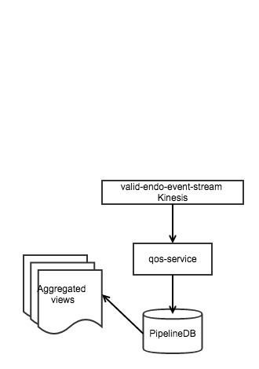
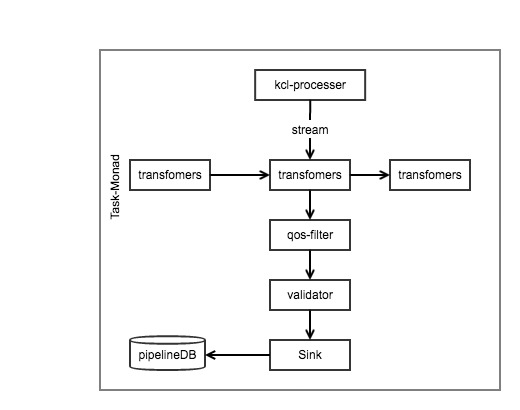

qos-service
====
qos service, publishes endo-qos related data to pipelineDB to:

#### Requirements

* JDK 1.8
* Scala 2.11.7+
* Scalaz 2.7.2
* sbt 13.11

### Summary
QoS is intended to monitor playback across all client platforms for quality of service and generate data usable via both Datadog and Redshift (Looker).

### qos-service components


### Detail
Scala based service that: 

- streams endo-events from AWS kinesis 
- filters for valid endo-events with qos attributes
- transforms events to qos streaming objects
- stores, sink, qos object to pipelineDB

#### setup
```
git clone https://github.com/kayvank/qos-service
sbt clean compile  // to build prject
sbt test // unit test
sbt it:test // integration test
sbt clean compile universal:packageBin // to generate an executable
sbt clean compile docker:publishLocal
```

#### To run the service locally

- install or run a dockerimage of pipelineDB
- configure piplelineDB
- set up environment variable for AWS credentials to point to kinesis stream
- build executable
- execute 

##### pipelineDB

- pull down pipelineDB  docker image:
```
docker run  -it --rm -v pgdata:~/var/lib/postgresql/data
docker run -d -p 5432:5432 -v pgdata:/Users/<MY_USER_NAME>/var/lib/postgresql/data pipelinedb/pipelinedb
```

- create ~/.pgpass for ease of login, see references for detail

```
0.0.0.0:5432:pipline:pipeline:pipeline
```

- create user & database
```
CREATE USER qos WITH PASSWORD 'qos' CREATEDB;
create database qos owner qos;
```

- DDL
```
create stream qos_stream (
 bitrate float,
 qos_startup_time float,
 qos_buffering_spinner_duration float,
 qos_buffering_spinner_events int,
 qos_buffering_at_end bool,
 video_id text, 
 video_url text, 
 is_ad bool,
 is_play bool, 
 region text, 
 city text,  
 country text, 
 lat_lon point,
 platform text,
 app_version text,
 build_number text,
 device text,
 user_id text,
 is_anon bool,
 ip text,
 user_agent text
);
```
- build executable
```
sbt clean compile universal:packageBin
```

- execute
```
cd ./target/universal
unzip qos-service-1.0.1.zip
cd qos-service-1.0.1
./bin/qos-service
```


### References

[cats,  scala types](http://typelevel.org/cats/)

[http4s, http library powered by cats](http://http4s.org/) 

[circe, json library  powered by cats](https://circe.github.io/circe/) 

[doobie, Relational algebra powered by cats](https://tpolecat.github.io/doobie-0.2.0/01-Introduction.html) 

[ Kinesis library kcl](http://docs.aws.amazon.com/streams/latest/dev/developing-consumers-with-kcl.html)

[pipelineDB Streaming SQL database](https://www.pipelinedb.com/) 

[pgpass configuration ](https://www.postgresql.org/docs/9.2/static/libpq-pgpass.html) 


